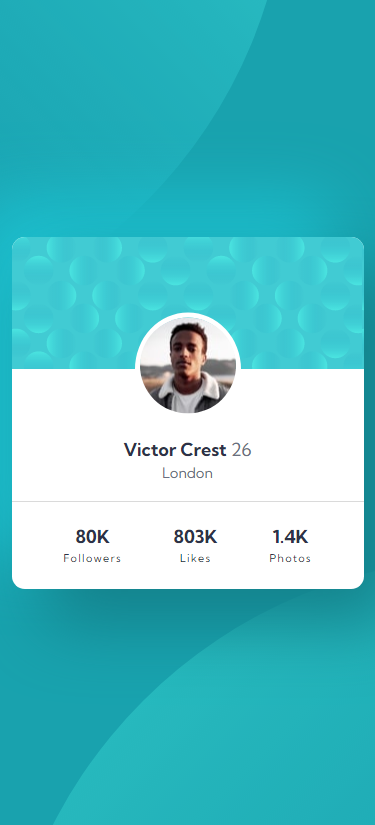

    <picture>
        <source
            media="(min-width: 768px)"
            srcset="./design/desktop.png"
        />
        
    </picture>

# Frontend Mentor - Profile card component solution

This is a solution to the [Profile card component challenge on Frontend Mentor](https://www.frontendmentor.io/challenges/profile-card-component-cfArpWshJ). Frontend Mentor challenges help you improve your coding skills by building realistic projects.

Live Site URL: <https://rehberbey.github.io/Frontend-Mentor-Challenges/profile-card-component-main/dist/index.html>
